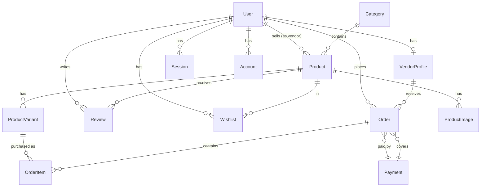

# Vendoor - Database Schema

Tài liệu chi tiết về cấu trúc database, models, relationships, và design decisions.

**Database Platform:** [Neon](https://neon.tech) (Serverless PostgreSQL) + Prisma v7 với Driver Adapter

---

## 📊 ERD Diagram



---

## 📋 Enums

### Role

```sql
enum Role {
  CUSTOMER   -- Khách hàng mua sắm
  VENDOR     -- Người bán (sau khi được approve)
  ADMIN      -- Quản trị viên
}
```

> **Note:** User có thể có nhiều roles (array). Một người có thể vừa là CUSTOMER vừa là VENDOR.

### VendorStatus

```sql
enum VendorStatus {
  PENDING    -- Chờ admin duyệt
  APPROVED   -- Đã được duyệt, có thể bán hàng
  REJECTED   -- Bị từ chối
  SUSPENDED  -- Bị đình chỉ (vi phạm quy định)
}
```

### OrderStatus

```sql
enum OrderStatus {
  PENDING_PAYMENT  -- Chờ thanh toán (Stripe)
  PENDING          -- Đã thanh toán/COD, chờ vendor xử lý
  PROCESSING       -- Vendor đang chuẩn bị hàng
  SHIPPED          -- Đã giao cho vận chuyển
  DELIVERED        -- Đã giao thành công
  CANCELLED        -- Đã hủy
  REFUNDED         -- Đã hoàn tiền
}
```

### PaymentStatus

```sql
enum PaymentStatus {
  PENDING    -- Chờ thanh toán
  COMPLETED  -- Thanh toán thành công
  FAILED     -- Thất bại
  REFUNDED   -- Hoàn tiền
}
```

### PaymentMethod

```sql
enum PaymentMethod {
  COD      -- Cash on Delivery
  STRIPE   -- Stripe online payment
  VNPAY    -- (Future)
  MOMO     -- (Future)
  ZALOPAY  -- (Future)
}
```

### ReviewStatus

```sql
enum ReviewStatus {
  PENDING   -- Chờ duyệt (nếu cần moderation)
  APPROVED  -- Đã duyệt, hiển thị
  REJECTED  -- Bị từ chối
}
```

---

## 📦 Models

### User & Authentication

#### User

```prisma
model User {
  id            String    @id @default(cuid())
  email         String    @unique
  name          String?
  phone         String?
  image         String?   // Avatar URL
  emailVerified Boolean   @default(false)
  roles         String[]  @default(["CUSTOMER"])

  createdAt     DateTime  @default(now())
  updatedAt     DateTime  @updatedAt

  // Relations
  accounts      Account[]
  sessions      Session[]
  vendorProfile VendorProfile?
  products      Product[]       // Nếu là vendor
  ordersAsCustomer Order[]      // Đơn hàng đã đặt
  reviews       Review[]
  wishlists     Wishlist[]
}
```

**Key points:**

- `roles` là **array** - một user có thể vừa CUSTOMER vừa VENDOR
- `vendorProfile` 1:1 relationship - chỉ có khi được approve làm vendor
- Dùng `cuid()` thay vì `uuid()` - shorter, URL-safe

#### Session

```prisma
model Session {
  id        String   @id @default(cuid())
  userId    String
  token     String   @unique
  expiresAt DateTime
  ipAddress String?
  userAgent String?

  user      User     @relation(...)
}
```

#### Account

```prisma
model Account {
  id           String  @id @default(cuid())
  userId       String
  providerId   String  // "credential" | "google" | ...
  accountId    String  // Provider's user ID

  // OAuth tokens (nullable cho credential provider)
  accessToken  String?
  refreshToken String?
  password     String? // Hashed password (cho credential)

  user         User    @relation(...)

  @@unique([providerId, accountId])
}
```

---

### Vendor

#### VendorProfile

```prisma
model VendorProfile {
  id          String       @id @default(cuid())
  userId      String       @unique  // 1:1 với User

  shopName    String       // Tên shop
  slug        String       @unique  // URL: /shop/abc-store
  description String?      @db.Text
  logo        String?      // Cloudinary URL
  banner      String?      // Cloudinary URL

  // Business info
  businessAddress String?
  businessPhone   String?
  businessEmail   String?

  // Commission
  commissionRate  Float    @default(0.1)  // 10%

  status      VendorStatus @default(PENDING)

  // Relations
  user        User         @relation(...)
  orders      Order[]
}
```

**Key points:**

- `slug` unique cho URL đẹp: `/shop/my-store`
- `commissionRate` có thể customize cho từng vendor
- `status` quyết định vendor có thể bán hàng không

---

### Product & Category

#### Category

```prisma
model Category {
  id          String    @id @default(cuid())
  name        String    @unique
  slug        String    @unique
  description String?   @db.Text
  image       String?

  products    Product[]
}
```

#### Product

```prisma
model Product {
  id          String    @id @default(cuid())
  vendorId    String    // FK to User (not VendorProfile)
  categoryId  String

  name        String
  slug        String    @unique
  description String?   @db.Text
  isActive    Boolean   @default(true)  // Soft delete

  // Relations
  vendor      User      @relation(...)
  category    Category  @relation(...)
  variants    ProductVariant[]
  images      ProductImage[]
  reviews     Review[]
  wishlists   Wishlist[]
}
```

**Key points:**

- `vendorId` link đến **User** (không phải VendorProfile) để query dễ hơn
- `slug` unique cho SEO-friendly URLs
- `isActive` cho soft delete

#### ProductVariant

```prisma
model ProductVariant {
  id          String   @id @default(cuid())
  productId   String

  name        String?  // "Đỏ - Size M" hoặc null nếu default
  sku         String?  @unique

  // Attributes (nullable)
  color       String?
  size        String?

  // Pricing (VND)
  price          Float
  compareAtPrice Float?  // Giá gốc (để hiển thị % giảm)

  // Inventory
  stock       Int      @default(0)
  isDefault   Boolean  @default(false)

  product     Product  @relation(...)
  orderItems  OrderItem[]
}
```

**Key points:**

- Products có thể không có variant (chỉ có default variant)
- `compareAtPrice` để hiển thị giá gạch + % giảm
- `stock` quản lý tồn kho tại variant level

#### ProductImage

```prisma
model ProductImage {
  id        String   @id @default(cuid())
  productId String
  url       String   // Cloudinary URL
  altText   String?
  order     Int      @default(0)  // 0 = ảnh chính
}
```

---

### Order & Payment

#### Order

```prisma
model Order {
  id          String      @id @default(cuid())
  orderNumber String      @unique  // "ORD-20250113-001"

  customerId  String      // FK to User
  vendorId    String      // FK to VendorProfile

  status      OrderStatus @default(PENDING_PAYMENT)

  // Pricing (VND)
  subtotal    Float    // Tổng tiền sản phẩm
  shippingFee Float    @default(0)
  tax         Float    @default(0)
  total       Float    // = subtotal + shippingFee + tax

  // Commission (QUAN TRỌNG)
  platformFee     Float   // = subtotal * platformFeeRate
  vendorEarnings  Float   // = subtotal - platformFee
  platformFeeRate Float   // Lưu lại để audit (VD: 0.1)

  // Shipping info (snapshot)
  shippingName     String
  shippingPhone    String
  shippingAddress  String
  shippingCity     String?
  shippingDistrict String?
  shippingWard     String?
  trackingNumber   String?  // Khi SHIPPED

  // Notes
  customerNote     String?  @db.Text
  vendorNote       String?  @db.Text

  // Relations
  customer    User          @relation("CustomerOrders", ...)
  vendor      VendorProfile @relation(...)
  items       OrderItem[]
  payment     Payment?      @relation(...)
  paymentId   String?
}
```

**Key points:**

- **1 Order = 1 Vendor**: Mỗi order chỉ thuộc 1 vendor
- `platformFeeRate` lưu lại để audit (không dựa vào vendor.commissionRate)
- Shipping info là **snapshot** tại thời điểm đặt hàng

#### OrderItem

```prisma
model OrderItem {
  id          String   @id @default(cuid())
  orderId     String
  variantId   String

  // Snapshot data (lưu lại thời điểm mua)
  productName   String
  variantName   String?
  price         Float   // Giá tại thời điểm mua
  quantity      Int
  subtotal      Float   // = price * quantity

  order       Order          @relation(...)
  variant     ProductVariant @relation(...)
}
```

**Key points:**

- `productName`, `price` là **snapshot** - không bị ảnh hưởng khi product thay đổi

#### Payment

```prisma
model Payment {
  id            String        @id @default(cuid())
  paymentNumber String        @unique  // "PAY-20250113-001"
  method        PaymentMethod
  status        PaymentStatus @default(PENDING)
  amount        Float

  // Stripe (nullable cho COD)
  stripeSessionId       String?  @unique
  stripePaymentIntentId String?  @unique

  // VNPay (future)
  vnpayTransactionId    String?  @unique

  paidAt        DateTime?

  orders        Order[]  // 1 payment có thể cover nhiều orders
}
```

**Key points:**

- 1 Payment có thể cover **nhiều Orders** (khi checkout có items từ nhiều vendors)
- Stripe fields nullable cho COD
- `paidAt` chỉ set khi thực sự thanh toán

---

### Review & Wishlist

#### Review

```prisma
model Review {
  id          String       @id @default(cuid())
  productId   String
  userId      String
  orderId     String?      // Link để verify "đã mua"
  orderItemId String?

  rating      Int          // 1-5 stars
  title       String?
  content     String?      @db.Text
  images      String[]     // Cloudinary URLs

  isVerifiedPurchase Boolean @default(false)

  // Vendor reply
  vendorReply   String?    @db.Text
  vendorReplyAt DateTime?

  status      ReviewStatus @default(APPROVED)

  product     Product      @relation(...)
  user        User         @relation(...)

  @@unique([userId, productId])  // 1 user chỉ review 1 lần/product
}
```

**Key points:**

- `isVerifiedPurchase` = true khi user đã mua sản phẩm này
- `vendorReply` cho phép vendor phản hồi
- Unique constraint: 1 user = 1 review/product

#### Wishlist

```prisma
model Wishlist {
  id        String   @id @default(cuid())
  userId    String
  productId String
  createdAt DateTime @default(now())

  user      User     @relation(...)
  product   Product  @relation(...)

  @@unique([userId, productId])
}
```

---

## 🔍 Indexes

Các indexes được tạo để optimize queries thường dùng:

```prisma
// User
@@index([email])

// VendorProfile
@@index([userId])
@@index([slug])
@@index([status])

// Product
@@index([vendorId])
@@index([categoryId])
@@index([slug])
@@index([isActive])

// ProductVariant
@@index([productId])
@@index([productId, isDefault])
@@index([sku])

// Order
@@index([customerId])
@@index([vendorId])
@@index([orderNumber])
@@index([status])
@@index([createdAt])

// Review
@@index([productId])
@@index([userId])
@@index([rating])
@@index([status])
```

---

## 🔄 Key Relationships

### User → VendorProfile (1:1)

```
User ──────── 1:1 ──────── VendorProfile
```

- Không phải mọi User đều có VendorProfile
- Chỉ có khi user đăng ký vendor và được approve

### Product → ProductVariant (1:N)

```
Product ──── 1:N ──── ProductVariant
```

- Mọi Product phải có ít nhất 1 variant (default)
- Variant chứa price, stock

### Order → VendorProfile (N:1)

```
Order ──── N:1 ──── VendorProfile
```

- 1 Order chỉ thuộc 1 Vendor
- Ngược lại 1 Vendor có nhiều Orders

### Payment → Order (1:N)

```
Payment ──── 1:N ──── Order
```

- 1 Payment có thể cover nhiều Orders (multi-vendor checkout)

---

## 📝 Design Decisions

### 1. Tại sao `vendorId` trong Product link đến User, không phải VendorProfile?

**Answer:** Để query products của vendor dễ hơn:

```typescript
// Dễ hơn khi cần join với user info
const products = await prisma.product.findMany({
  where: { vendorId: userId },
  include: { vendor: true }, // Trả về User object
});
```

### 2. Tại sao lưu snapshot trong OrderItem?

**Answer:** Để đảm bảo order history chính xác:

- Nếu vendor thay đổi giá product, orders cũ không bị ảnh hưởng
- Nếu vendor xóa product, orders vẫn hiển thị đúng tên

### 3. Tại sao 1 Order = 1 Vendor?

**Answer:**

- Shipping riêng cho từng vendor
- Tracking number riêng
- Commission calculation đơn giản
- Order status quản lý độc lập

### 4. Tại sao dùng cuid() thay vì uuid()?

**Answer:**

- Shorter (25 chars vs 36 chars)
- URL-safe (không có dấu `-`)
- Collision-resistant
- Time-sortable (roughly)

---

## 🔗 Related Documentation

- [TECHNICAL_DECISIONS.md](./TECHNICAL_DECISIONS.md) - Lý do chọn Prisma
- [DATA_FLOW.md](./DATA_FLOW.md) - Luồng data qua các tables
