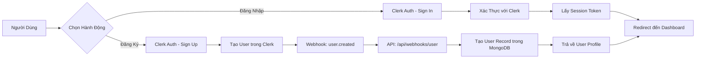
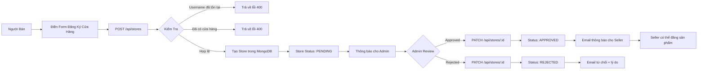
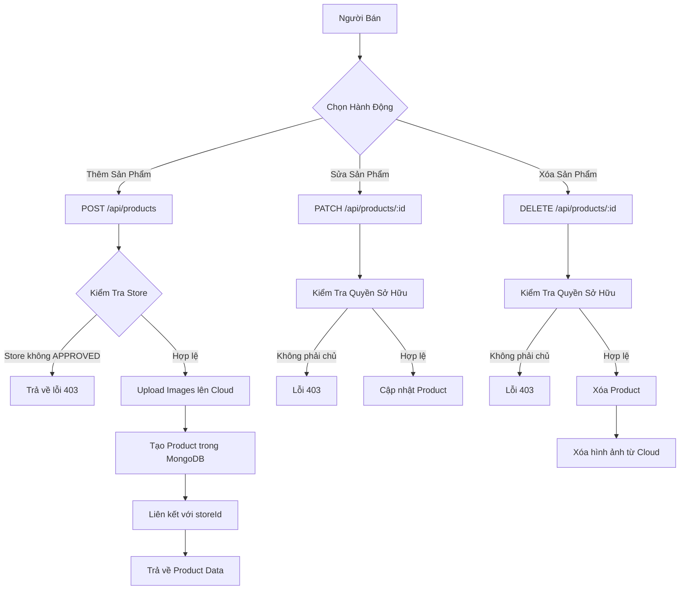
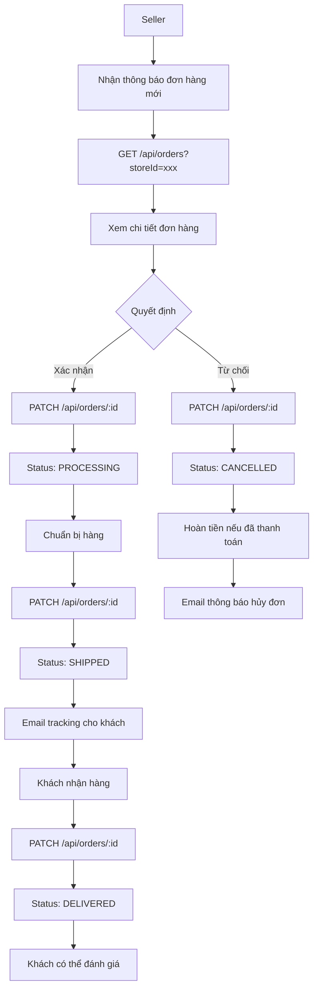
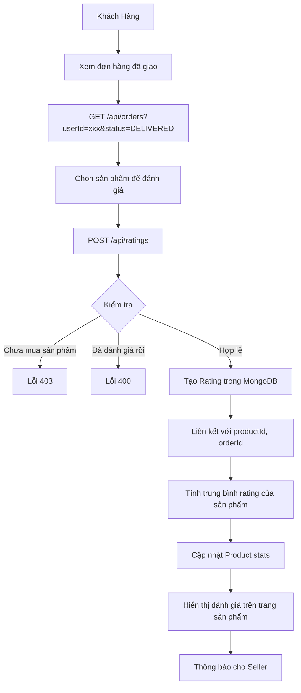
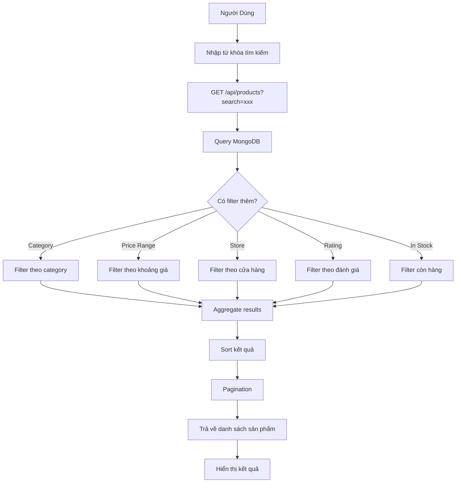
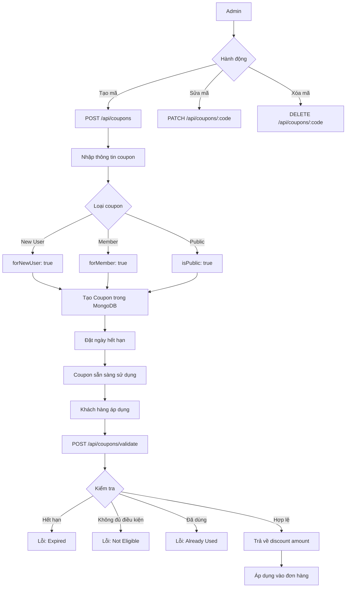

# Sơ Đồ Luồng Dữ Liệu - Vendoor E-Commerce Platform

## 1. Luồng Đăng Ký & Đăng Nhập Người Dùng

## 2. Luồng Tạo & Duyệt Cửa Hàng

## 3. Luồng Quản Lý Sản Phẩm

## 4. Luồng Mua Hàng & Thanh Toán

```mermaid
flowchart TD
    A[Khách Hàng] --> B[Duyệt Sản Phẩm]
    B --> C[GET /api/products]
    C --> D[Hiển thị danh sách sản phẩm]

    D --> E[Chọn sản phẩm]
    E --> F[Thêm vào giỏ hàng - Client State]

    F --> G{Tiếp tục mua?}
    G -->|Có| E
    G -->|Không| H[Xem Giỏ Hàng]

    H --> I{Áp dụng mã giảm giá?}
    I -->|Có| J[POST /api/coupons/validate]
    I -->|Không| K[Chọn địa chỉ giao hàng]

    J --> L{Mã hợp lệ?}
    L -->|Có| M[Tính giảm giá]
    L -->|Không| N[Thông báo lỗi]

    M --> K
    N --> K

    K --> O{Có địa chỉ sẵn?}
    O -->|Không| P[POST /api/addresses]
    O -->|Có| Q[Chọn địa chỉ có sẵn]

    P --> R[Lưu địa chỉ mới]
    R --> S[Chọn phương thức thanh toán]
    Q --> S

    S --> T{Phương thức?}
    T -->|COD| U[POST /api/orders]
    T -->|Card| V[POST /api/payment/create-intent]

    V --> W[Stripe Payment]
    W --> X{Thanh toán thành công?}
    X -->|Có| U
    X -->|Không| Y[Thông báo lỗi]

    U --> Z[Tạo Order trong MongoDB]
    Z --> AA[Tạo OrderItems]
    AA --> AB[Cập nhật Stock]
    AB --> AC{Có dùng coupon?}
    AC -->|Có| AD[Đánh dấu coupon đã dùng]
    AC -->|Không| AE[Email xác nhận đơn hàng]
    AD --> AE

    AE --> AF[Thông báo cho Seller]
    AF --> AG[Redirect đến trang Order Success]
```

## 5. Luồng Xử Lý Đơn Hàng (Seller)

## 6. Luồng Đánh Giá Sản Phẩm

## 7. Luồng Tìm Kiếm & Lọc Sản Phẩm

## 8. Luồng Quản Lý Mã Giảm Giá

## Tóm Tắt Các API Endpoints Chính

### Authentication

- Clerk Webhooks: `/api/webhooks/user`

### Stores

- `GET /api/stores` - Danh sách cửa hàng
- `POST /api/stores` - Tạo cửa hàng mới
- `PATCH /api/stores/:id` - Cập nhật cửa hàng
- `DELETE /api/stores/:id` - Xóa cửa hàng

### Products

- `GET /api/products` - Danh sách sản phẩm (có filter, search)
- `GET /api/products/:id` - Chi tiết sản phẩm
- `POST /api/products` - Tạo sản phẩm mới
- `PATCH /api/products/:id` - Cập nhật sản phẩm
- `DELETE /api/products/:id` - Xóa sản phẩm

### Orders

- `GET /api/orders` - Danh sách đơn hàng
- `GET /api/orders/:id` - Chi tiết đơn hàng
- `POST /api/orders` - Tạo đơn hàng mới
- `PATCH /api/orders/:id` - Cập nhật trạng thái đơn hàng

### Addresses

- `GET /api/addresses` - Danh sách địa chỉ
- `POST /api/addresses` - Tạo địa chỉ mới
- `PATCH /api/addresses/:id` - Cập nhật địa chỉ
- `DELETE /api/addresses/:id` - Xóa địa chỉ

### Ratings

- `GET /api/ratings?productId=xxx` - Đánh giá của sản phẩm
- `POST /api/ratings` - Tạo đánh giá mới

### Coupons

- `POST /api/coupons/validate` - Xác thực mã giảm giá
- `GET /api/coupons` - Danh sách mã (admin)
- `POST /api/coupons` - Tạo mã mới (admin)

### Payments

- `POST /api/payment/create-intent` - Tạo payment intent với Stripe
- `POST /api/payment/webhook` - Webhook từ Stripe
