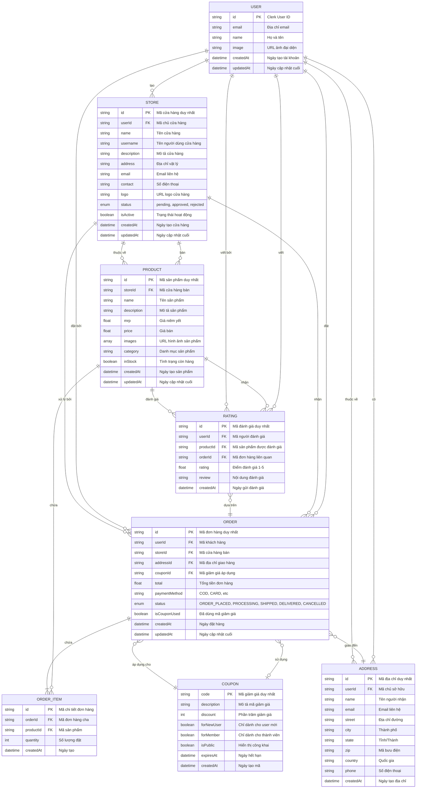

# Sơ Đồ ER Database - Nền Tảng Thương Mại Điện Tử Vendoor

## Các Mối Quan Hệ Chính

### Mối Quan Hệ Người Dùng

- **USER → STORE**: Một người dùng có thể tạo một cửa hàng (tài khoản người bán)
- **USER → ORDER**: Một người dùng có thể đặt nhiều đơn hàng
- **USER → RATING**: Một người dùng có thể viết nhiều đánh giá sản phẩm
- **USER → ADDRESS**: Một người dùng có thể có nhiều địa chỉ đã lưu

### Mối Quan Hệ Cửa Hàng

- **STORE → PRODUCT**: Một cửa hàng có thể bán nhiều sản phẩm
- **STORE → ORDER**: Một cửa hàng có thể nhận nhiều đơn hàng

### Mối Quan Hệ Sản Phẩm

- **PRODUCT → ORDER_ITEM**: Một sản phẩm có thể xuất hiện trong nhiều chi tiết đơn hàng
- **PRODUCT → RATING**: Một sản phẩm có thể có nhiều đánh giá

### Mối Quan Hệ Đơn Hàng

- **ORDER → ORDER_ITEM**: Một đơn hàng chứa nhiều sản phẩm
- **ORDER → ADDRESS**: Mỗi đơn hàng giao đến một địa chỉ
- **ORDER → COUPON**: Mỗi đơn hàng có thể sử dụng một mã giảm giá (tùy chọn)

### Tính Năng Bổ Sung

- **Hệ Thống Mã Giảm Giá**: Hỗ trợ giảm giá cho người dùng mới, thành viên và mã công khai
- **Hệ Thống Đánh Giá**: Liên kết với cả sản phẩm và đơn hàng để xác thực đánh giá
- **Đa Nhà Bán**: Mỗi sản phẩm và đơn hàng được liên kết với một cửa hàng cụ thể

## Quy Tắc Nghiệp Vụ

1. **Tạo Cửa Hàng**: Người dùng phải đăng ký và được admin phê duyệt trước khi cửa hàng hoạt động
2. **Quản Lý Sản Phẩm**: Chỉ cửa hàng đã được duyệt mới có thể đăng sản phẩm
3. **Xử Lý Đơn Hàng**: Đơn hàng được xử lý bởi từng cửa hàng riêng biệt
4. **Xác Thực Mã Giảm Giá**: Kiểm tra trạng thái người dùng (mới/thành viên) và ngày hết hạn
5. **Hệ Thống Đánh Giá**: Người dùng chỉ có thể đánh giá sản phẩm từ đơn hàng đã hoàn thành
6. **Quản Lý Địa Chỉ**: Nhiều địa chỉ cho mỗi người dùng, chọn một địa chỉ cho mỗi đơn hàng
